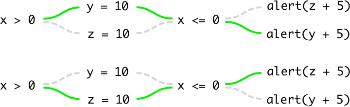

# Try..catch in JavaScript async abstractions like Promise or Task

This article explains the reasoning behind how errors catching works in Task.
It starts from very fundamental concepts, but it's necessary to avoid misunderstanding
later in the article when some terms from earlier parts are used.
The closer to the end the more practical matters are discussed.

## Expected and unexpected code paths

In any program (especially in JavaScript) there always expected and unexpected code paths.
When a program goes through an unexpected path we call it "a bug". And when it goes only through expected paths
is just normal execution of the program. Consider this example:

```js
let x = Math.random() - 0.5
let y
let z

if (x > 0) {
  y = 10
} else {
  z = 10
}

if (x <= 0) {
  alert(z + 5)
} else {
  alert(y + 5)
}
```

Here are two expected paths of this program:



And here is an unexpected path:


We as programmers don't expect this to ever happen with this program.
But if, for example, we change first condition and forget to change second one program may
run through the unexpected path. That would be a bug.


## Railway oriented programming / split expected path in two

Also we can introduce some abstractions and semantics that would split **expected path** into
**expected success** and **expected failure**. If you understand `Either` type you know what I'm talking about.
This is fairly common pattern in FP world, I'll try to explain it briefly, but here are some good
articles that do a much better job:

- ["Railway oriented programming"](https://fsharpforfunandprofit.com/posts/recipe-part2/)
- ["A Monad in Practicality: First-Class Failures"](http://robotlolita.me/2013/12/08/a-monad-in-practicality-first-class-failures.html)
- ["Practical Intro to Monads in JavaScript: Either"](https://tech.evojam.com/2016/03/21/practical-intro-to-monads-in-javascript-either/)

Say we build a simple CLI program that takes a number `n` from user and prints `1/n`.

```js
function print(str) {
  console.log(str)
}

function main(userInput) {
  const number = parseInt(userInput, 10)

  if (Number.isNaN(number)) {
    print(`Not a number: ${userInput}`)
  } else {
    if (number === 0) {
      print(`Cannot divide by zero`)
    } else {
      print(1 / number)
    }
  }

}

// Read a line from stdin somehow and apply main() to it.
// Details of how it's done are not important for this example.
main(inputFromStdin)
```

In this example execution flow of the program looks like this:


As you can see program splits in two places. This happens very often in programs.
In some cases all branches look neutral, in other cases (like this) we can consider one path as
a success and another one as a failure. We can make the distinguish more formal by
introducing an abstraction:

```js
const Either = {
  chain(fn, either) {
    return ('success' in either) ? fn(either.success) : either
  },
  fork(onSuccess, onFailure, either) {
    return ('success' in either) ? onSuccess(either.success) : onFailure(either.failure)
  },
}
```

Now we can rewrite our example using `Either`:

```js
function print(str) {
  console.log(str)
}

function parse(str) {
  const number = parseInt(str, 10)
  return Number.isNaN(number) ? {failure: `Not a number: ${str}`} : {success: number}
}

function calc(number) {
  return number === 0 ? {failure: `Cannot divide by zero`} : {success: 1 / number}
}

function main(userInput) {
  const parsed = parse(userInput)
  const calculated = Either.chain(calc, parsed)
  Either.fork(print, print, calculated)
}
```

In this version flow looks more like the folowing. It looks simpler, like we simply write code
that cannot fail and Either takes care of managing failure branch.


Maybe this doesn't make much sense to you now (if you're not familiar with Either).
And this is by no means a complete explanation of Either pattern (check out resources
I've mentioned above for better explanations). But for the purpose of this article the only
thing we need to take out of this section is that some paths in program can be
treated formally or informally as **expected failures**.

Let's recap. We've split all possible paths in programs to three groups:

- **Expected success** is the main happy path of the program,
  it represents how program behaves when everything goes right.
- **Expected failure** is secondary path that represent
  all expected deviations from happy path e.g., when user gives an incorrect input.
- **Unexpected failure** is some *unexpected* deviations from main or secondary paths,
  something that we call "bugs".


## try..catch

How does `try..catch` fits into our three code paths groups view? It's great for unexpected failures!
Or we should say: `throw` great for unexpected failures if we never actually `try..catch`.
It's very good for debugging. Debugger will pause on the exact line that throws.
Also if we don't use debugger we still get nice stack trace in console etc. It's sad that in many
cases when program goes through unexpected path instead of exception we end up with `NaN`
being propagated through program or something like that. In these cases it's much harder to track
down where things went wrong, much nicer when it just throws.

On the other hand `try..catch` is bad for expected failures. There're many reasons why, but let's
focus on just one: *it's bad for expected failures because it's already used for unexpected ones.*
We must handle expected failures, so we would need to `try..catch` function that uses
`throw` for expected failure. But if we do that we'll catch not only errors that represent
expected failures, but also random errors that represent bugs. This is bad for two reasons:

1. we ruin nice debugging experience (debugger will no longer pause etc);
2. in our code that is supposed to handle expected failures we would need to also
   handle unexpected failures (which is generally imposible as shown in the next section).

If throw is used for expected failures in some API, we should wrap into `try..catch` as little code as
possible, so we won't also catch bugs by accident.


## How program should behave in case of unexpected failures

Try..catch provide us with a mechanism for writing code that will be executed in case of *some*
unexpected failures. We can just wrap arbitrary code into `try..catch`, and we catch bugs
that express themselves as exceptions in that code. Should we use this mechanism and what
handling code in `catch(e) {..}` should do?

Let's look at this from theoretical point of view first and dive into practical
details in next sections.

First of all let's focus on the fact that this mechanism catches only **some** failures.
In many cases program may not throw but just behave incorrectly in some way.
In my expirience with JavaScript I'd estimate that it throws only in about 30% of cases.
So should we even care to use this mechanism if it works only in 30% cases?

If we still want to use it, what the handling code should do? I can think of two options:

1. Try to completelly recover somehow and keep program running.
2. Crash / restart program and log / report about the bug.

The `#1` option is simply impossible. We can't transition program from arbitrary
unexpected (inconsistent) state to an expected (consistent) state. For the simple reason that
starting state is **unexpected** — we don't know anything about it, because we didn't expect it.
How could we transition from a state of which we don't know anything to any other state?
There is one way to do it though — restart the program, which is our `#2` option.

Also any code that is executed in responce to a bug have a potential to make things worse.
It transitions program to even more complicated inconsistent state. Plus if program continue to run
the inconsistent state may leak to database. In this scenario even a restart may not help.
And if many users are connected to a single database they all may start to experience the bug.

The `#2` is often happens automatically (at least crash part), so maybe we don't
even need to `catch`. But it's ok to cathc for `#2` purposes.


## Unexpected failures in Node

We could restart the server on each unhandled exception, but this is problematic because server
usually handles several requests concurently at the same time. So if we restart the server
not only request that have faced a bug will fail, but all other requests that happen to be
handled at the same time will fail as well. Some people think that a better approach is to wrap all
the code that responsible for handling each request to some sort of `try..catch` block and when
a error happens fail only one request. Although we can't use `try..catch` of course because the
code is asynchronous. So we should use some async abstraction that can provide this functionality (e.g. Promises).

Another option for Node is to let server crash. Yes, this will result in forcefully ending the execution of all other connections, resulting in more than a single user getting an error. But we will benefit from the crash by taking core dumps (`node --abort_on_uncaught_exception`) etc.

Also in Node we can use the `uncaughtException` event combined with a tool like [naught](https://github.com/andrewrk/naught). Here is a qoute from naught docs:

> Using naught a worker can use the 'offline' message to announce that it is dying. At this point, naught prevents it from accepting new connections and spawns a replacement worker, allowing the dying worker to finish up with its current connections and do any cleanup necessary before finally perishing.

Conclusion: we might want to catch unexpected errors in Node, but there are plenty other options.


## Unexpected failures in browser

In case of a browser restarting (reloading the page) usually considered as an awful behavior from
the UX point of view, so it might be not an option. We may choose not to restart in a hope of
providing a better UX at a risk of leaking inconsistent state to the database etc. Some bugs are
indeed not fatal for a web page, and it often may continue to work mostly fine. So this is a
trade–off and to not restart is a legitimate option here.

Also in case of a browser we might want UI to react to the bug somehow. But in case of arbitrary
bug there isn't much we can do again. In case of an *expected* failure (like the incorrect user input)
we can handle it very well from UI/UX poit of view — we should show an error message near the exact
field in the form, also we may dissable the submit button etc. In case of a bug we don't really know
what is going on, so we can only do something like showing a popup with a very vague message.
But I think this won't be very helpfull, it may actually be worse than not showing a popup.
Maybe user not even going to interact with the part of the program that has broken, and a popup out
of nowhere may only damage UX. And if user do interact with the broken part they will notice that
it's broken anyway — no need to tell what they already know. Also if we show a popup user might
assume that something failed, but now it's all under control and it's safe to continue to use the
program. But this would be a lie, nothing is under control in case of a bug.

Conclusion: we have no reason to catch unexpected errors in browser.


## Promises and expected failures

Promises support two code paths. There're two callbacks in `then` etc.
Also Promises automatically cathc all exceptions thrown from then's callbacks and put them into
the next failure callback down the chain.

So the second path is already used for unexpected failures.
That makes it unusable for expected failures (see ["try..catch" section](#trycatch)).
In other words Promises don't support Railways / Either pattern. If you want to use that pattern with Promises
you should wrap Either into Promise. To use Promise's second path for this is a terrible idea.


## Should async abstractions support exceptions catching?

From previous sections we've learned that we definitely may want to not catch exceptions at all.
In this case we get the best debugging experience. Even if abstraction will cathc exceptions and then
re-throw, it won't be the same as to not catch at all, for instance debugger won't pause on
the original line of `throw`.

But we also may want to catch "async exceptions", for instance in Node web server case.
A perfect solution would be optional catching.

Not all abstractions can support optional cathcing. If we have to choose between non-optional
catching and not supporting catching at all we should choose latter.
Non-optional catching hurts more than helps.

This part seems to be ok in Promises. If we don't provide failure callback in `then` and don't use
`catch` method it seems that debugger behaves the same way as if error wasn't catched
(at least in current Chrome). Although it wasn't always this way, previously they used to simply
swallow exceptions if there wasn't a catch callback.


## How exceptions work in Task

In Task we want to support both **optional** errors catching and Railways / Either patern.
When we `run()` a task we can choose whether errors will be catched or not,
and if they are catched they go into a separate callback.

```js
// exceptions are not catched
task.run({
  success(x) {
    // handle success
  },
  failure(x) {
    // handle expected failure
  },
})

// if we provide catch callback exceptions are catched
task.run({
  success(x) {
    // handle success
  },
  failure(x) {
    // handle expected failure
  },
  catch(e) {
    // handle a bug
  },
})
```

So if `catch` callback isn't provided, we can enjoy great debugging expirience in a browser (even if we have `failure` callback). And in Node we can still catch exceptions in async code if we want to. Also notice that we use a separate callback for exceptions, so we won't have to write code that have to handle both expected and unexpected failures.

The default behaviour is to not catch. This is what we want in browser, and what also may be a legitimate option for Node.

In Task the `catch` callback is reserved only for bug-exceptions. Expected exception must be wrappend in a `try..catch` block manually. All the API and semantics in Task are designed with this assumption in mind.

Exceptions thrown from `success` and `failure` callbacks are never catched, even if `catch` callbacks is provided.

```js
task.run({
  success() {
    // this error won't be catched
    throw new Error('')
  },
  catch(error) {
    // the error above will not go here
  }
})
```

This is done because otherwise we might end up with half of the code for `success` being executed plus the code for `catch`, which in most cases isn't what we want. For example in a web server case, we could start sending response for `success` case, but then continue by sending the response for `catch`. Instead we should catch manually:

```js
task.run({
  success() {
    try {
      // ...
      res.send(/* some part of success response */)
      // ...
      // supposedly some code here have thrown
      // ...
    } catch (e) {
      // do something about the exception
      // but keep in mind that "some part of success response" was already sent
    }
  },
  catch(error) {
    // handle error thrown from .map(fn) etc.
  }
})
```
